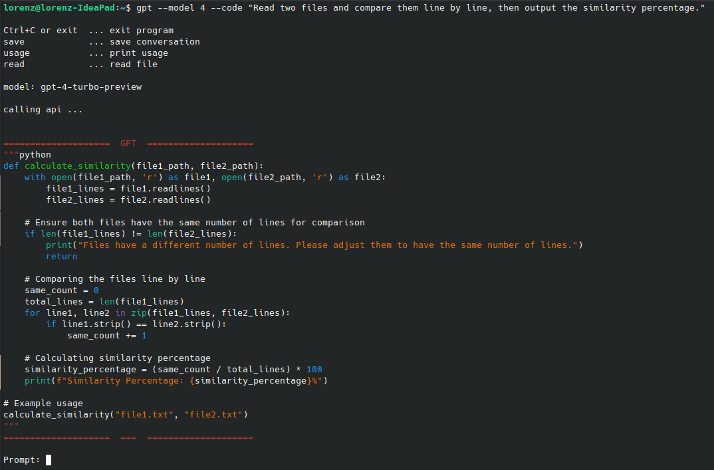
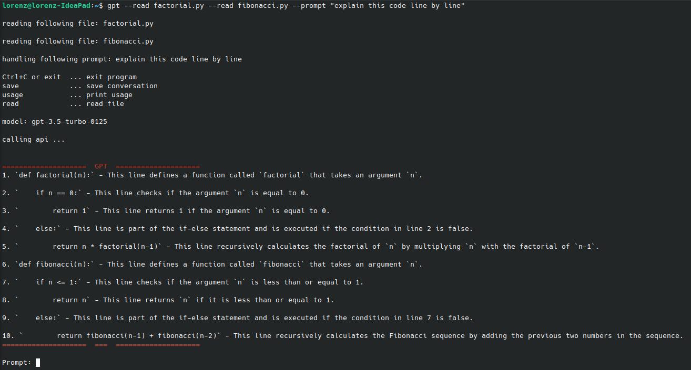

# GPT Chatbot for the Command Line

This is a simple chatbot that interacts with the OpenAI API to provide conversational responses in the command line interface.
The default model is gpt-3.5-turbo It uses the OpenAI API key, which needs to be exported to the `OPENAI_API_KEY` environment variable.

## Installation

To use the GPT Chatbot for the Command Line, follow these steps:

1. Clone the repository:

   ```bash
   git clone https://github.com/lorenzdoe/terminal-chatbot.git
   ```

2. Change into the cloned directory:

   ```bash
   cd terminal-chatbot
   ```

3. Install the required dependencies:

   Optional: Create and acitvate a virtual environment
   ```bash
   python3 -m venv venv
   source venv/bin/activate
   ```

   Install the required packages
   ```bash
   pip install -r requirements.txt
   ```

   You may need to install `tkinter` for file dialogues
   
   ```bash
   sudo apt-get install python3-tk
   ```

4. Export your OpenAI API key as an environment variable:

   ```bash
   export OPENAI_API_KEY=<your-api-key>
   ```

## Usage

To use the chatbot, run the following command:

```bash
python main.py
```

Once the chatbot is running, you can start interacting with it by typing your messages into the command line. The chatbot will process your input and provide a response.

The chatbot is also capable of reading files and saving conversations to given filenames.

```
Usage: main.py [options...]
 -h, --help                   print the help for the program
 -p, --prompt    <message>    pass a prompt for processing
 -r, --read      <rel-path>   pass a file to be read
                              pass multiple -r flags to read multiple files
 -m, --model     <version>    pass 3 for gpt-3.5-turbo, default is gpt-4
 -c, --code      <message>    pass a message to produce code, default is python
 -s, --shell     <message>    pass a message to produce shell command, default is bash
 -t, --translate <message>    pass a message to produce translation, default is english
```

after starting the program
```
Ctrl+C or exit  ... exit program
save            ... save conversation
usage           ... print usage
read            ... read file
```
read and save opens file dialogue to select location

## Setup to run from any directory

### Option 1: pyinstaller

You can use `pyinstaller` to create a standalone executable that can be run from any directory. To do this, run the following command:

```bash
pyinstaller --onefile main.py
```

This will create a standalone executable in the `dist` directory. This can be moved to path and run from any directory.

### Option 2: custom alias

You can create a custom alias to run the chatbot from any directory. To do this, add the following line to your `.bashrc` or `.zshrc` file:

```txt
alias gpt="/path/to/python-executable /path/to/main.py"
```

## Customization

You can customize the behavior of the chatbot by modifying the `handler.py` script. For example, you can change the prompt that is sent to the API or adjust the parameters for the chat conversation.

You can also cutomize the options like temperature and model by adjusting the values in the `api.py` file

## Contributing

If you find any issues with the GPT Chatbot for the Command Line or have suggestions for improvement, please feel free to open an issue or submit a pull request on the [GitHub repository](https://github.com/openai/gpt-3.5-turbo).

## License

This project is licensed under the [MIT License](https://opensource.org/licenses/MIT).

## Examples

Produce code for given input 



Read files and process prompt

